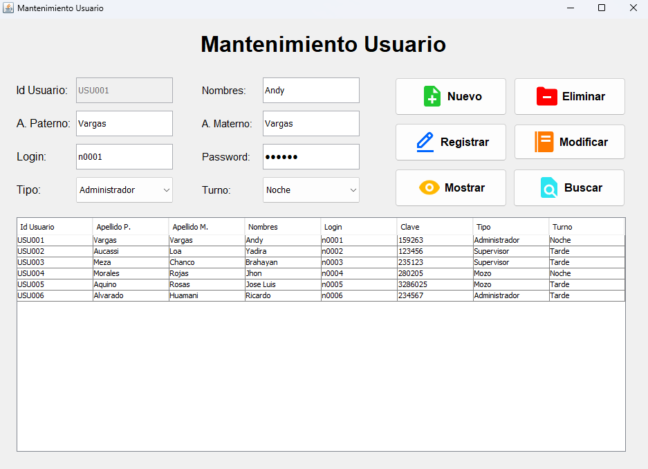
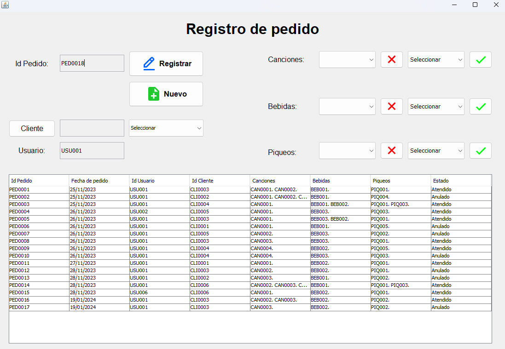
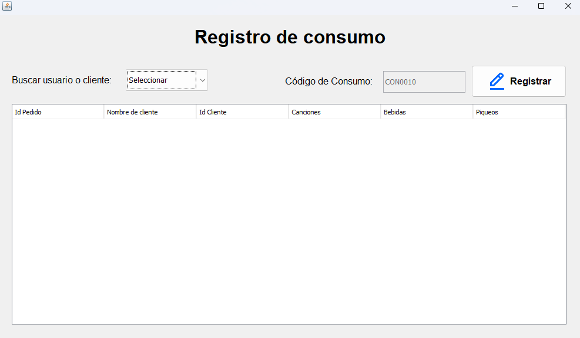
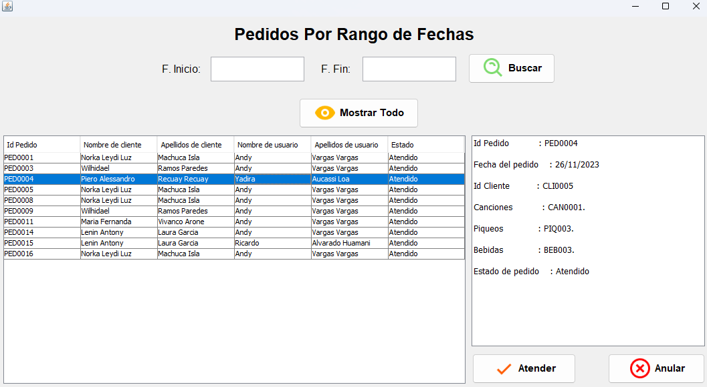
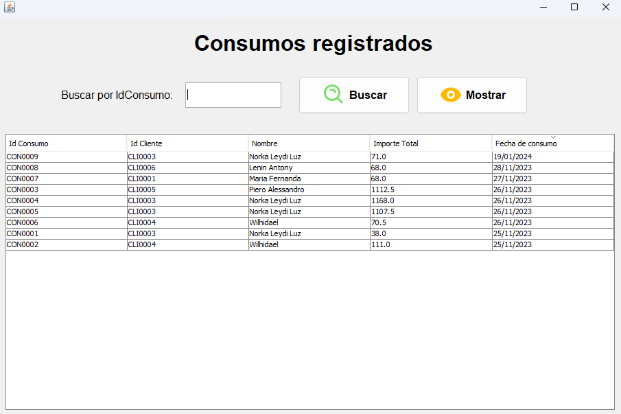

# Karaoke Manager 🎤🎶

¡Bienvenido al Karaoke Manager! 🎉 Este es el lugar donde la diversión nunca termina y la música nunca para. Con nuestra plataforma de gestión de karaoke, llevar la experiencia del karaoke al siguiente nivel nunca ha sido tan fácil y emocionante. 💃🕺

## Descripción

¡Prepárate para una experiencia épica de karaoke con nuestro sistema de gestión todo en uno! Desde la selección de canciones hasta el registro de pedidos de bebidas y piqueos, hemos creado una plataforma que hace que la organización de tu karaoke sea más divertida que nunca.

## Funcionalidades Principales

- **Selección de Canciones:** 🎵 ¡Deja que tus clientes elijan sus éxitos favoritos de nuestro amplio catálogo de canciones!
- **Registro de Pedidos:** 🍹 ¿Qué es una fiesta de karaoke sin bebidas y piqueos? Registra todos los pedidos y mantén la fiesta en marcha.
- **Gestión de Comentarios:** 💬 Escuchamos a nuestros clientes. Recopila sus comentarios y sugerencias para mejorar la experiencia general del karaoke.

## Módulos del Sistema

1. **Módulo de Mantenimiento:** 👩‍💻 Gestiona la información clave del sistema, desde usuarios hasta canciones y artistas.
2. **Módulo de Pedidos:** 📝 Facilita el proceso de registro y seguimiento de los pedidos de bebidas, piqueos y canciones.
3. **Módulo de Registro de Consumo:** 💰 Registra todas las ventas y consumo de productos para un análisis detallado de ingresos.
4. **Módulo de Consultas:** 🔍 Realiza consultas rápidas y obtén información sobre el estado del karaoke en cualquier momento.
5. **Módulo de Reportes:** 📊 Genera informes detallados sobre el rendimiento del negocio y la satisfacción del cliente.

## Clases Principales

- **Usuario:** 👤 Gestiona los usuarios del sistema, desde administradores hasta personal de servicio.
- **Cliente:** 🎉 Almacena la información de nuestros queridos clientes que nos visitan para cantar.
- **Canción:** 🎤 Representa las canciones disponibles en nuestro catálogo, ¡listas para ser interpretadas!
- **Artista:** 🎸 Contiene los detalles de los talentosos artistas detrás de las canciones.
- **Género:** 🎶 Define los diversos estilos musicales presentes en nuestro repertorio.
- **Pedido:** 🍻 Registra todos los pedidos realizados por los clientes, ¡desde canciones hasta bebidas y piqueos!

## Objetivo del Proyecto

Nuestro objetivo es simple: ¡hacer que cada visita al karaoke sea inolvidable! Con un diseño atractivo, funcionalidades emocionantes y una actitud festiva en el corazón de todo lo que hacemos, estamos aquí para que tu karaoke sea la mejor fiesta de todas. ¡Vamos a cantar, bailar y crear recuerdos que durarán toda la vida! 🎉🎤🎶

## Usuarios Predefinidos 🎵👤

¡No te preocupes por la configuración inicial! Incluimos algunos usuarios predefinidos para que puedas empezar a usar el Karaoke Manager de inmediato:

1. **Admin1**
   - **Login:** n0001
   - **Contraseña:** 159263

2. **Admin2**
   - **Login:** n0006
   - **Contraseña:** 234567

3. **Supervisor1**
   - **Login:** n0002
   - **Contraseña:** 123456

4. **Supervisor2**
   - **Login:** n0003
   - **Contraseña:** 235123

5. **Mozo1**
   - **Login:** n0004
   - **Contraseña:** 280205

6. **Mozo2**
   - **Login:** n0005
   - **Contraseña:** 3286025

¡Listo para empezar a rockear con el Karaoke Manager! 🚀🎶

